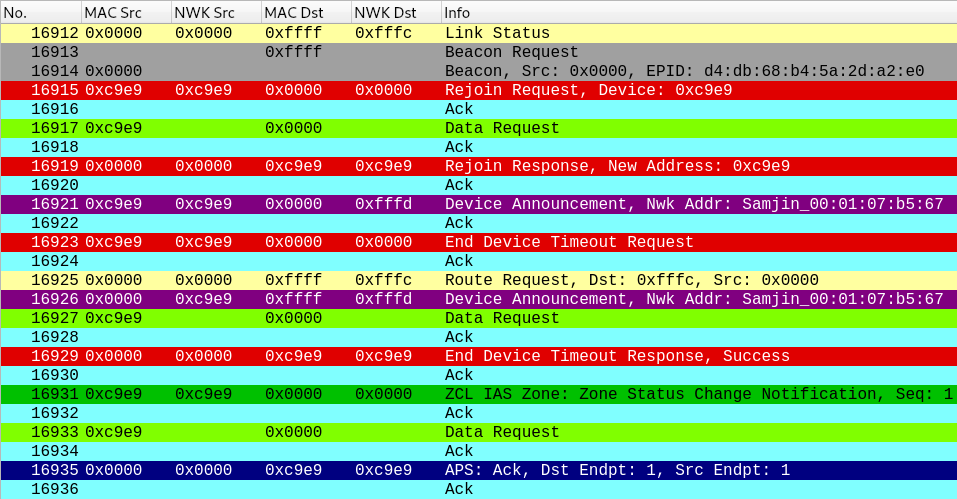

# wireshark-zigbee-profile

Wireshark configuration profile for Zigbee traffic


## Installation

You can install this Zigbee profile by copying the `Zigbee` folder of this repository and pasting it inside the `profiles` folder of your Wireshark personal configuration directory.
In Linux distributions, this directory is typically located at `~/.config/wireshark`.
In this case, you can install it by executing the following commands:
```
$ git clone https://github.com/akestoridis/wireshark-zigbee-profile.git
$ cp -r wireshark-zigbee-profile/Zigbee/ ~/.config/wireshark/profiles/Zigbee/
```
Regardless of your operating system, you can find the path of your Wireshark personal configuration directory by opening Wireshark, navigating to `Help`>`About Wireshark`>`Folders`, and inspecting the `Location` column of the `Personal configuration` row.
Once you have copied the `Zigbee` folder of this repository and pasted it inside the `profiles` folder of your Wireshark personal configuration directory, you can enable it by opening Wireshark, navigating to `Edit`>`Configuration Profiles...`, and selecting the `Zigbee` profile.


## Screenshots

The following screenshot showcases some of the profile's coloring rules, but several columns were hidden and the text was slightly enlarged to be more legible. A more detailed screenshot is available [here](screenshot-wide.png).


